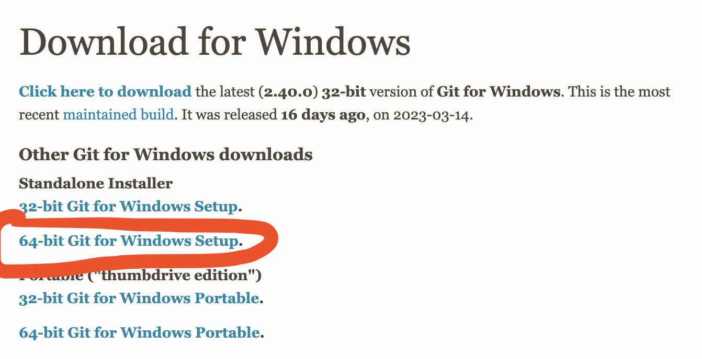

# Welcome to Java Course 2023
### Today Plan
- Download Git Bash on Window
- Check if mac already have git
- Download IntelliJ and Java 17 on both platform
- Learn basic window command line
- Learn basic git command line

## How to download Git bash on Window
- Go to this website: [https://git-scm.com/download/](https://git-scm.com/download/)
- Chose window from the option
- 
- Choose the 64 bit option, as shows in the image
- Once it asks to save, save it.
- Double-click on just downloaded file and follow the instruction to finish the installation.

## How to download Git bash on Mac
- First open your terminal and type `git --version`
- If you see: `git version 2.37.1 (Apple Git-137.1)` or something similar that means git is in your laptop already
- If you don't see it, follow the instruction bellow:
  - You will need to download the homebrew
  - In your terminal type : `/bin/bash -c "$(curl -fsSL https://raw.githubusercontent.com/Homebrew/install/HEAD/install.sh)"`
  - Once Homebrew is installed
  - type this: `brew install git`
  - Once it's done type this to check the latest version: `git --version`